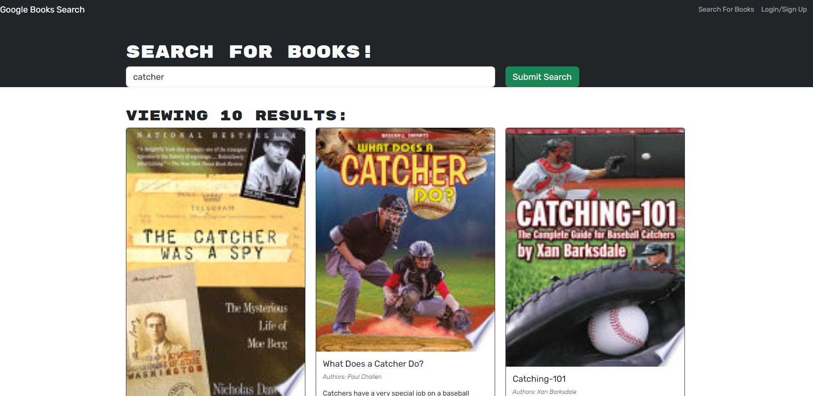

# Book-Search-Engine

Welcome to the Book Search Engine. This application is designed to help avid readers like you find new books and keep track of books to purchase. It is built on a Google Books API search engine and utilizes a MERN stack with a React front end, MongoDB database, and a Node.js/Express.js server and API.

## How to Use the App
Load the Search Engine: Upon opening the app, you will see a menu with options to "Search for Books" and "Login/Signup". There's also an input field to search for books and a submit button.

Search for Books: Click on the "Search for Books" menu option. Enter your search term into the input field and click the submit button. You'll be presented with several search results, each featuring a book’s title, author, description, image, and a link to that book on the Google Books site.

Login/Signup: Click on the "Login/Signup" menu option. A modal will appear on the screen with a toggle between the option to log in or sign up.

Sign Up: Set the toggle to "Signup". Enter a username, an email address, and a password, then click the signup button. Your user account will be created and you will be logged into the site.

Login: Set the toggle to "Login". Enter your account’s email address and password then click on the login button. The modal will close and you will be logged into the site.

Search and Save Books: Once logged in, the menu options will change to "Search for Books", "See Saved Books", and "Logout". Enter a search term in the input field and click the submit button. Click on the "Save" button on a book to save it to your account.

View Saved Books: Click on the "See Saved Books" option to view all of the books you have saved to your account. Each book will have its title, author, description, image, and a link to the book on the Google Books site. There will also be a "Remove" button to delete a book from your account.

Logout: Click on the "Logout" button when you're done. You will be logged out of the site and presented with the original menu.

## Screenshot of Usage:

## License
This project is licensed under the terms of the MIT license.